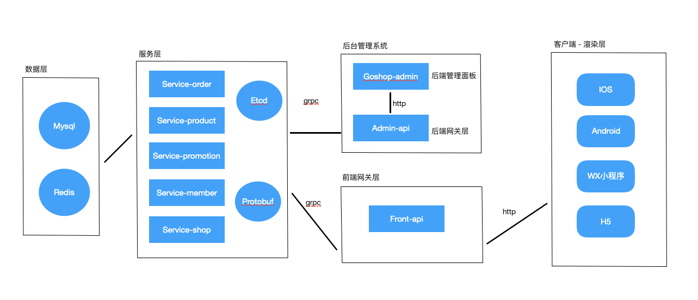

# goshop

##### 1,描述

goshop是一个开源的电商系统，前端以uniapp开发，支持多平台，后端以gin框架开发，整体以微服务架构设计。

##### 2，服务介绍

商品服务 （service-product)  
订单服务（service-order）  
会员服务（service-member）  
营销服务（service-promotion）    
基础服务（service-shop）  
Protobuf (pb、在各服务中通过 go get -u github.com/shinmigo/pb 更新安装）  
支付库 （gopay、在各服务中通过 go get -u github.com/shinmigo/gopay 更新安装）  
后台网关层 （admin-api)  
前台网关层 （front-api）  
后台管理 （goshop-admin）    

##### 3，架构图

##### 4，部署流程

1，安装go环境，支持go 1.12及以上版本  
2，安装web服务，如nginx 或 apache等，安装mysql 8.0及以上，安装redis 3.x及以上    
3，安装服务发现etcd 支持etcd v3.4及以上版本  
4，导入goshop数据库，数据库sql文件在goshop-doc仓库中 
5，开启etcd  
6，编译运行 service-product、service-order、service-member、service-promotion、service-shop 各服务之间不用关心启动的顺序  
7，编译运行 admin-api默认端口8099、front-api默认端口8199  
8，部署后台管理系统，配置nginx或apache等    
以上运行起来之后，就可以访问相关的服务了   

